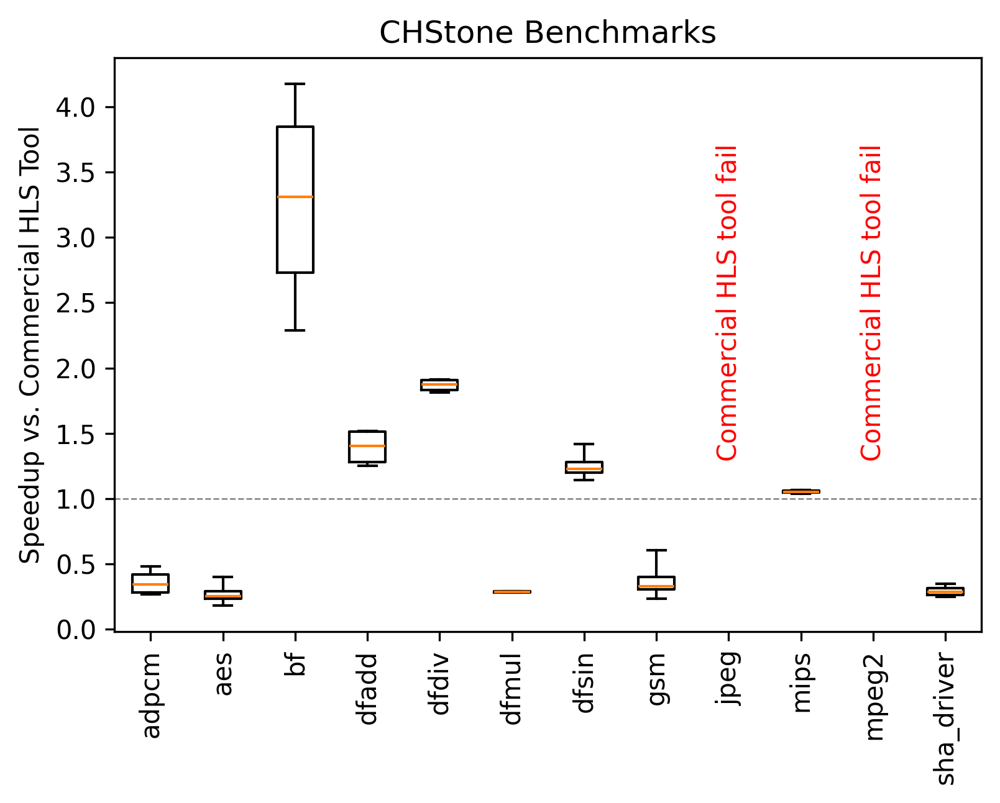
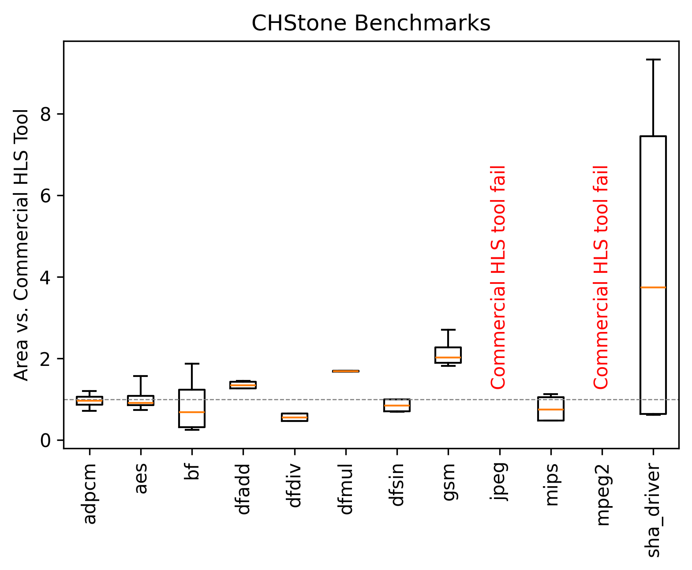
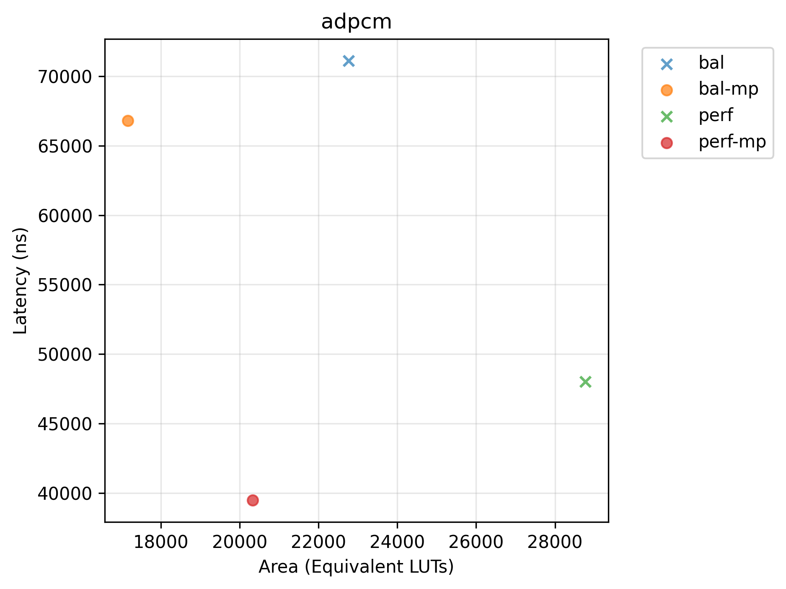
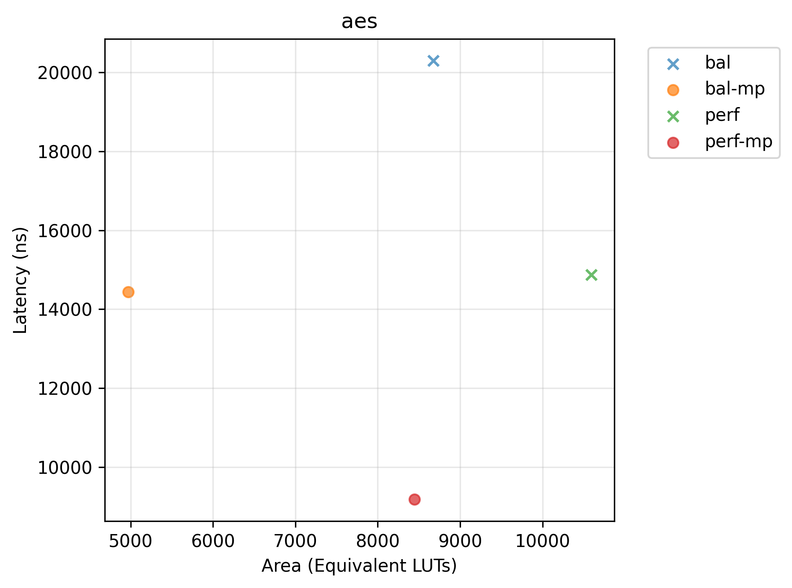
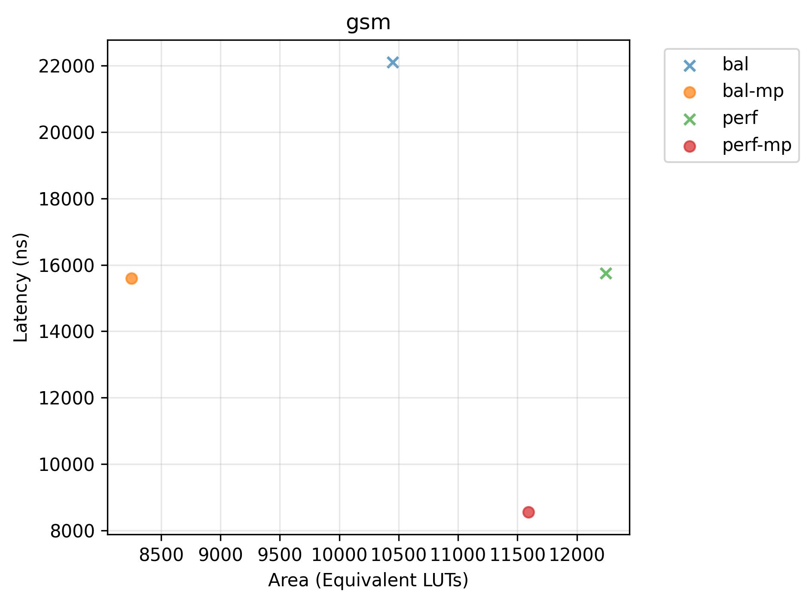
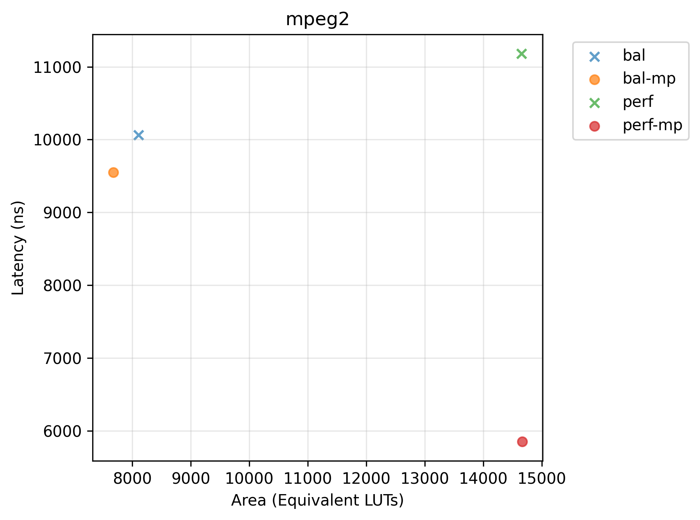

# &#128060; CHStone Results

## Introduction
We evaluate accelerators generated by Bambu on the standard benchmark suite CHStone proposed in:

> Yuko Hara, Hiroyuki Tomiyama, Shinya Honda and Hiroaki Takada, “Proposal and Quantitative Analysis of the CHStone Benchmark Program Suite for Practical C-based High-level Synthesis”, Journal of Information Processing, Vol. 17, pp.242-254, (2009).

A comparison with a standard commercial HLS tool is provided when possible.

---

## Setup

- Target hardware: AMD/Xilinx Virtex7 FPGA.
- Target frequency: 200 MHz.
- Source code for the benchmarks is available in [examples/CHStone](../../examples/CHstone).

---

## Summary
### Speedup over commercial HLS tool for a set of different Bambu configurations across all benchmarks.

*Latency is measured in ns (clock cycles * achieved period post-implementation). > 1 is better.*

  </img>

### Area consumption over commercial HLS tool for a set of different Bambu configurations across all benchmarks.
*Area is measured in Equivalent LUTs (BRAMs * 40 + DRAMs * 40 + DSPs * 40 + Registers * 0.5 + LUTs). < 1 is better.*

  </img>

---

## Trade-offs

We highlight the effect of selecting different values for the `--experimental-setup` option, which steers Bambu towards different trade-offs between performance and area.

*Pareto plots (Latency vs. Area) for selected benchmarks. Points marked with x are dominated.*

  
   

  
   

---

## Detailed Results

Post-p&r timing and area metrics for each benchmark and each selected configuration are available in a separate [table](tables/chstone.md).